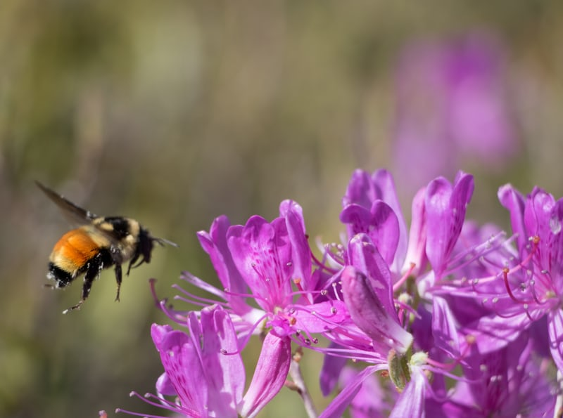

-   [Home](#heroBanner)
-   [Projects](#projects)
-   [About Me](#about-me)
-   [Skills](#skills)
-   [Gallery](./gallery.html)
-   [Contact me](#contact-me)
-   [More about BCH](https://en.bc.fi/)

Welcome to my porfolio!
-----------------------

Projects

#### Todo List

Vanilla js, DOM objects.

#### Recipe App

HTML,CSS and React js

#### Food Tracker App

Node js,HTML,CSS

### About Me

+--------------------------------------+--------------------------------------+
|      | #### Hei, I'm Shubhangi Naik         |
|                                      |                                      |
|                                      | " I'm a web developer with a focus   |
|                                      | on the MERN stack, but still         |
|                                      | exploring other technologies and     |
|                                      | frameworks that catch my interest!   |
|                                      | if you're looking for a developer to |
|                                      | add to your team, I'd love to hear   |
|                                      | from you! I am always experimenting, |
|                                      | always learning, and never bored.    |
+--------------------------------------+--------------------------------------+

### My skills

#### HTML

#### CSS

#### Problem solving

#### Software testing

### Contact Me

Your name: \
 Your email: \
 Your message: \

SEND MESSAGE

Copyright © My Website 2021

[**](https://github.com/shubhanginaik/)
[**](https://www.linkedin.com/in/shubhangi-naik-5300136a/)

Top
